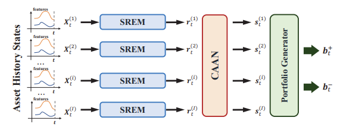
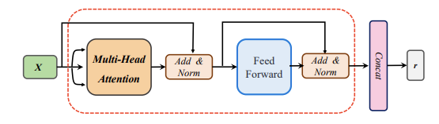

# HouliPortfolio : Deep Reinforcement Learning Algorithm for Portfolio Optimization

## Table of Contents

- [Overview](#overview)
- [Methodology](#methodology)
- [Results](#results)

## Overview

Portfolio construction and management is a very important and difficult part of finance. It requires making allocation decisions under uncertainty. Given the 
high-dimensional, noisy, and nonlinear nature of financial and economic data, traditional methods (in machine learning especially) can have serious drawbacks.

The task of this competition is to use an agent/critic reinforcement learning algorithm to optimize portfolio construction given a set of assets. With the complexity
of financial data, searching using trial-and-eror through a flexible modeling space to directly maximize a portfolio management objective can be more effective than 
attempting to estimate prices or returns directly and then prescribing portfolio weight based on that. Attention-based modeling can also improve capturing long-term memory and
nonlinearity.

## Methodology

Overall, the model consists of two main architectures: the portfolio generator architecture and the RL architecture. The portfolio generator architecture is 
taken directly from the AlphaPortfolio model, which includes using sequence representation extraction models (SREMs) to extract a representation for each asset in its 
state history. In this case, a transformer encoders are used as the SREMs. For more reading on transformers, one can look at my S&P 500 Betting with Transformers project.
Then, those representations are sent into a Cross-Asset Attention Network (CAAN) which takes the representations of all assets as inputs to extract relationships among the assets. Lastly, the final portfolio generator takes the scalar winner score for every asset from CAAN and derives the optimal portfolio
weights.

This architecture is embedded into a reinforcement learning framework to train the model parameters to maximize an evaluation criterion. This project uses an actor-critic 
objective minimizing temporal difference (TD) error while maximizing advantage-weighted actions, regularized by a global Sharpe ratio bonus.

## Results

This project is still ongoing and results will be posted once completed.